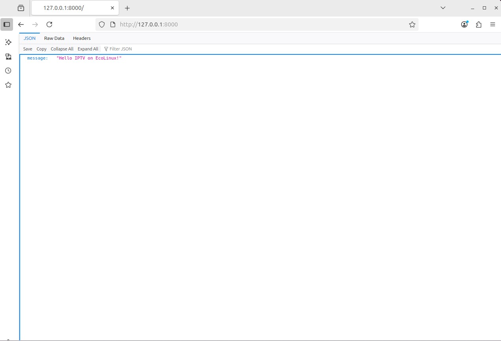
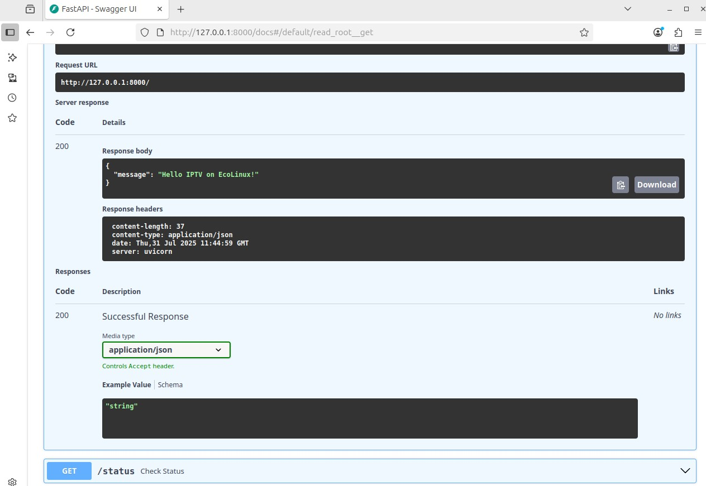
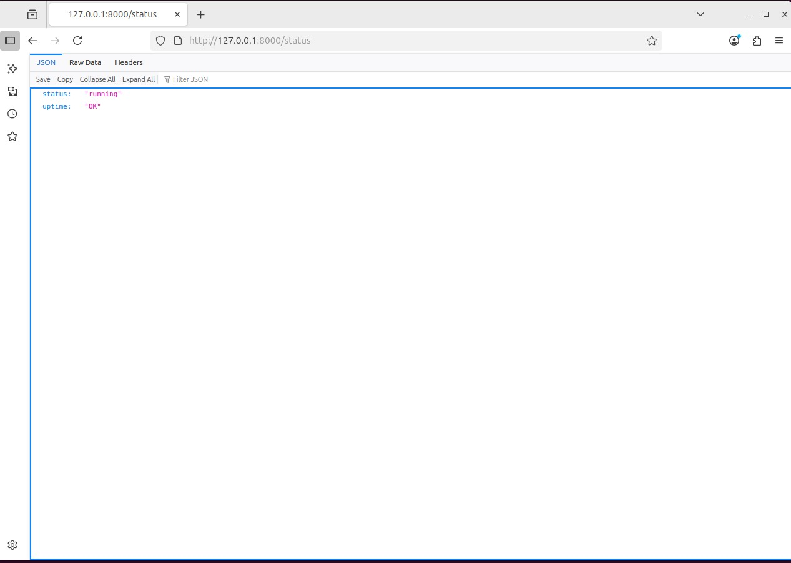
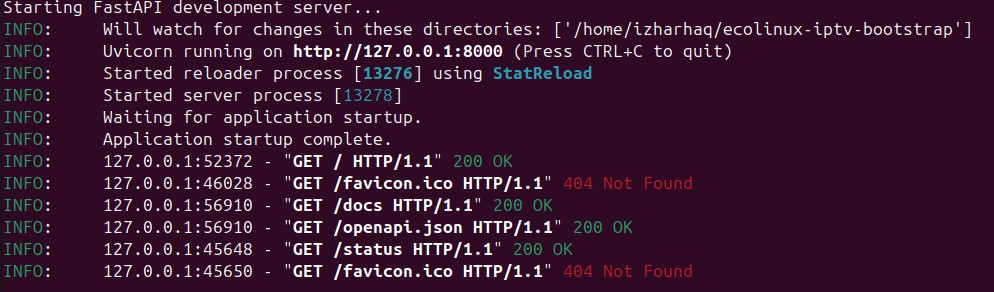

#  EcoLinux IPTV Bootstrap Script

A lightweight Linux-based IPTV provisioning utility that installs media playback dependencies and starts a FastAPI API server for basic control and health-check functionality.

This project is tailored for embedded Linux firmware (like EcoLinux) where IPTV clients must be deployed via systemd, shell scripts, and web APIs.

---

##  Project Goals

- Automate the installation of IPTV playback tools (e.g., `ffmpeg`, `vlc`)
- Expose a FastAPI-based service with `/` and `/status` endpoints
- Provide a systemd unit to auto-start the player on boot
- Showcase Linux scripting, API integration, and system orchestration

---

##  Project Structure

```text
ecolinux-iptv-bootstrap/
├── app/                     # Python FastAPI app logic
│   ├── __init__.py
│   └── main.py              # Your FastAPI app entrypoint
│
├── docs/                    # Documentation and screenshots
│   └── screenshot_terminal_output.png
│
├── scripts/                 # Shell automation scripts
│   └── install.sh
│
├── services/                # OS-level services
│   └── iptv.service
│
├── test_data/               # Sample IPTV playlist
│   └── playlist.m3u8
│
├── .dockerignore
├── .gitignore
├── LICENSE
├── README.md
├── requirements.txt         # Project dependencies
└── run_dev.sh               # Dev launcher script for FastAPI

Running the App (Dev Mode)
./run_dev.sh
This script will:
Activate the testenv virtual environment
Validate that uvicorn is installed
Start the FastAPI app using --reload for live development

If the environment is missing, run:
python3 -m venv testenv
source testenv/bin/activate
pip install -r requirements.txt

API Endpoints
| Method | Endpoint  | Description                       |
| ------ | --------- | --------------------------------- |
| GET    | `/`       | Returns greeting message          |
| GET    | `/status` | Returns service health and uptime |

Interactive Swagger Docs:
http://127.0.0.1:8000/docs

Systemd Integration
To enable the IPTV service at boot:
sudo cp services/iptv.service /etc/systemd/system/iptv.service
sudo systemctl daemon-reexec
sudo systemctl enable iptv.service
sudo systemctl start iptv.service

Docker Hub Image
This project is published to Docker Hub:
https://hub.docker.com/r/izharhaq86/ecolinux-iptv
You can pull and run it directly:
docker pull izharhaq86/ecolinux-iptv
docker run -d -p 8000:8000 izharhaq86/ecolinux-iptv

Docker Usage (Manual Build)
Build the Docker Image
docker build -t ecolinux-iptv .

Run the Docker Container
docker run -d -p 8000:8000 ecolinux-iptv

Optional: Mount Local Playlist into Container
docker run -d -p 8000:8000 \
-v $(pwd)/test_data/playlist.m3u8:/app/test_data/playlist.m3u8 \
ecolinux-iptv

 (Optional) Stop and Remove Container
docker ps                 # View running containers
docker stop <container_id>
docker rm <container_id>

Installation Script
To install all dependencies and configure the system on bare metal:
chmod +x scripts/install.sh
sudo ./scripts/install.sh

Test Playlist
Included in test_data/playlist.m3u8:
#EXTM3U
#EXTINF:-1, Sample Channel 1
http://example.com/stream1.ts

#EXTINF:-1, Sample Channel 2
http://example.com/stream2.ts

##  Screenshot

### Uvicorn Running in Terminal



###  Swagger UI



###  Status Response



###  Terminal Output Snapshot



Tech Stack
Bash (Allman style scripting)
FastAPI (Python 3.12)
ffmpeg / VLC
systemd
EcoLinux-compatible setup

License
MIT License — free to use, modify, and share.

Maintained by
Izhar Haq
Senior Embedded & Software Engineer
github.com/izharhaq1987


<!-- Force GitHub to refresh image preview -->

<!-- GitHub cache bust for image render -->
